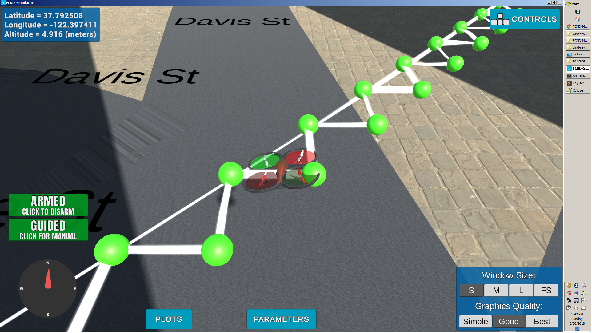

## Project: 3D Motion Planning

---

# Required Steps for a Passing Submission:
1. Load the 2.5D map in the colliders.csv file describing the environment.
2. Discretize the environment into a grid or graph representation.
3. Define the start and goal locations.
4. Perform a search using A* or other search algorithm.
5. Use a collinearity test or ray tracing method (like Bresenham) to remove unnecessary waypoints.
6. Return waypoints in local ECEF coordinates (format for `self.all_waypoints` is [N, E, altitude, heading], where the drone’s start location corresponds to [0, 0, 0, 0].
7. Write it up.
8. Congratulations!  Your Done!

## [Rubric](https://review.udacity.com/#!/rubrics/1534/view) Points
### Here I will consider the rubric points individually and describe how I addressed each point in my implementation.  

---
### Writeup / README

#### 1. Provide a Writeup / README that includes all the rubric points and how you addressed each one.  You can submit your writeup as markdown or pdf.  

You're reading it! Below I describe how I addressed each rubric point and where in my code each point is handled.

### Explain the Starter Code

#### 1. Explain the functionality of what's provided in `motion_planning.py` and `planning_utils.py`
These scripts contain a basic planning implementation that includes.. 
1. motion_planning.py : It is event driven code that get reads the planners and execute flight. The workflow can thought as :
	+ Make a connection to the drone using UdaciDrone API
	+ Start the drone and follow phases/STATES of flight i.e. -> MANUAL -> ARMING -> TAKEOFF -> LANDING -> DISARMING defined in states ENUM
	+ It starts with defining the target position
	+ register position, velocity and state callback
	+ On every new events received, follow the respective callback

   planning_utils.py : 
    + create_grid() : Create GRID representation of 2D space configuration based on obstacle data 
    + ACTION class : Creates an Action that returns 3 element tuple, first tuple is movement in North-South, second is movement in East-West and last tuple is cost that we are assuming to be same
    + valid_actions() : returns a list of valid actions for current_node. It checks whether the next node is off the grid or an obstacle and returns the value 
    + a_star() : Implementation of a_star() search algorithm that takes grid, heurictic method, start and goal state as input to find the shortest path between start and goal state.	 

And here's a  image of my results 

Here's | A | Snappy | Table
--- | --- | --- | ---
1 | `highlight` | **bold** | 7.41
2 | a | b | c
3 | *italic* | text | 403
4 | 2 | 3 | abcd

### Implementing Your Path Planning Algorithm

#### 1. Set your global home position
Here students should read the first line of the csv file, extract lat0 and lon0 as floating point values and use the self.set_home_position() method to set global home. Explain briefly how you accomplished this in your code.

I have read first line in colliders.csv to read latitude and longitude. then I assigned it using self.set_home_position(lat0,lon0,0)

#### 2. Set your current local position
Here as long as you successfully determine your local position relative to global home you'll be all set. Explain briefly how you accomplished this in your code.

To successfully determine local postion relative to global home, I have used *global_to_local* method. It converts global geodetic (longitude,latitude, altitude) to UTM
(easting, northing, zone number , zone letter) and then to local NED (north, east , down)

#### 3. Set grid start position from local position
This is another step in adding flexibility to the start location. As long as it works you're good to go!

I have set the local position for grid_start. I am randomizing the local postion value using numpy's rint method.

#### 4. Set grid goal position from geodetic coords
This step is to add flexibility to the desired goal location. Should be able to choose any (lat, lon) within the map and have it rendered to a goal location on the grid.

Similar to grid start, I have taken one random coording and then randomizing the goal position using numpy's rint method.

#### 5. Modify A* to include diagonal motion (or replace A* altogether)
Minimal requirement here is to modify the code in planning_utils() to update the A* implementation to include diagonal motions on the grid that have a cost of sqrt(2), but more creative solutions are welcome. Explain the code you used to accomplish this step.

I have added  diagonal motion in Action Class by adding new diagonal actions. I am using np.sqrt(2) method to assign cost to diagonal motion. Also, I have updated the valid_actions check for it 

#### 6. Cull waypoints 
For this step you can use a collinearity test or ray tracing method like Bresenham. The idea is simply to prune your path of unnecessary waypoints. Explain the code you used to accomplish this step.

I am using collinearty check to prune path so that it doesn't move zone by zone if not required. If colineary checks passes, it remove the subpoints between two points.

### Execute the flight
#### 1. Does it work?
It works!

### Double check that you've met specifications for each of the [rubric](https://review.udacity.com/#!/rubrics/1534/view) points.
  
# Extra Challenges: Real World Planning

For an extra challenge, consider implementing some of the techniques described in the "Real World Planning" lesson. You could try implementing a vehicle model to take dynamic constraints into account, or implement a replanning method to invoke if you get off course or encounter unexpected obstacles.

